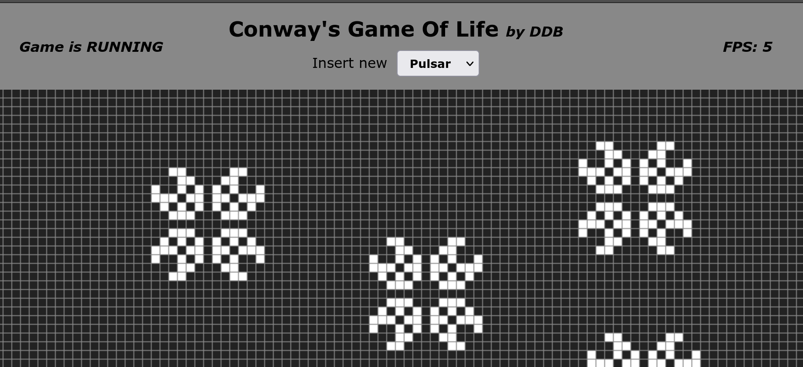

# Conway's Game Of Life

[Wiki: Conway's Game of Life](https://en.wikipedia.org/wiki/Conway%27s_Game_of_Life)

## Setup 
> npm install && npm run build
## and run
Use browser-sync to host on localhost:3000
>  npm run browser-sync

or open/serve index.html however you want

## Features
1. Game of Life's default rules, of course
2. Pause / Resume
3. Presets
   1. Select pattern-presets to insert onto grid
   2. Preview what to insert onto grid
4. 'Infinite' grid (it loops back around the edges)
5. (WiP) Dynamic resizing and cell-scaling 
6. (TODO) Gameplay (0)_(0)

## But why? 
First, I always wanted to build my own implementation of G.O.L.  
Second, I wanted to challenge myself a little and so I created basically just a playground to practice some minor things:
1. setup typescript/ts-node/esbuild compile-and-bundle process
2. Mess around with canvas/drawing a bit
3. Mess around with Typescript
4. Potentially practice with some data-structures, optimization and the like
